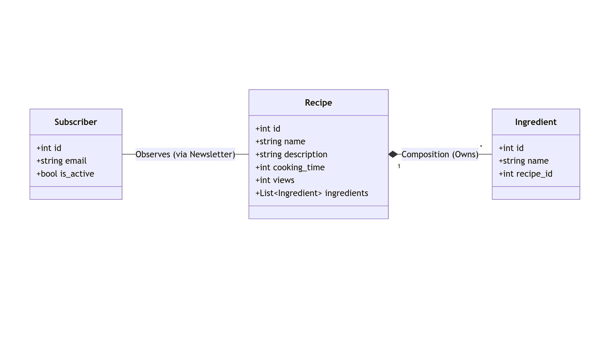
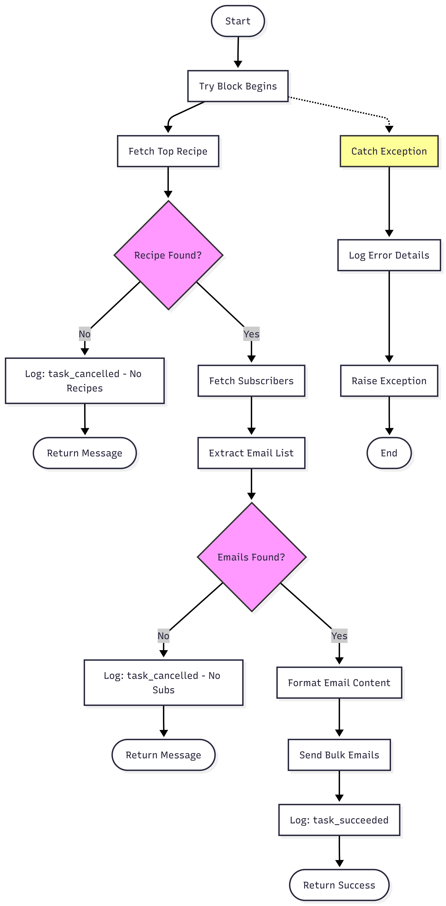
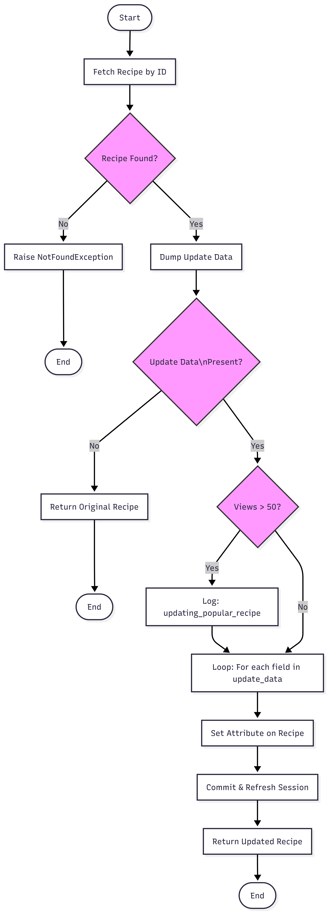

# Async Cookbook API 🍳



A high-performance, asynchronous REST API for managing recipes and newsletter subscriptions. Built with **FastAPI**, **Docker**, **PostgreSQL**, **Redis**, and **Celery**.

## 🚀 Features

* **Async API:** Built on FastAPI with `async/await` for high concurrency.
* **Background Tasks:** Celery + Redis worker for sending weekly newsletters without blocking the API.
* **Database:** PostgreSQL with **SQLModel** (SQLAlchemy + Pydantic) for ORM.
* **Validation:** Strict data validation using Pydantic (Email format, min/max lengths).
* **Monitoring:** Full observability stack with **Prometheus** metrics, **Grafana** dashboards, and **Sentry** error tracking.
* **Testing:** Comprehensive `pytest` suite with **45 assertions** covering security, logic, and data integrity.

## 🛠️ Tech Stack

* **Language:** Python 3.12
* **Framework:** FastAPI
* **Database:** PostgreSQL (AsyncPG driver)
* **Queue:** Redis & Celery
* **Containerization:** Docker & Docker Compose

## 📂 Project Structure

```text
├── app/
│   ├── api/            # Route handlers (v1)
│   ├── core/           # Config, Security, DB connection
│   ├── models/         # SQLModel Database Tables
│   ├── schemas/        # Pydantic Request/Response schemas
│   ├── services/       # Business logic (Newsletter, etc.)
│   ├── worker.py       # Celery task definitions
│   └── main.py         # App entry point
├── tests/              # Pytest suites
├── docker-compose.yml  # Infrastructure orchestration
└── requirements.txt    # Python dependencies
```

## ⚡ Quick Start

### 1. Run with Docker (Recommended)

This spins up the API, DB, Redis, Worker, Prometheus, and Grafana automatically.

```bash
docker compose up -d --build
```

**Access points:**
- API Docs: http://localhost:8000/docs
- Grafana: http://localhost:3000 (admin/admin)
- Prometheus: http://localhost:9090

### 2. Run Tests

The test suite uses an in-memory SQLite database and Mocks, so it runs instantly.

```bash
# Install dependencies
pip install -r requirements.txt

# Run the suite
pytest -v
```

## 🎓 Homework 2: Structural & Quality Testing

This section documents the advanced testing methodologies implemented for the second homework assignment, focusing on Basis-Path Testing, Mutation Testing, and Table-Based Testing.

### Task 1: Structural Basis-Path Testing

We performed structural analysis on two core functions to ensure 100% logical coverage. Flowcharts were generated to identify independent basis paths, satisfying a Cyclomatic Complexity (V(G)) of 4 and 5 respectively.

#### 1. app.api.services.newsletter.send_weekly_email

**Complexity:** 4

**Testing Goal:** Validate the newsletter workflow including recipe fetching, subscriber extraction, and exception handling.



#### 2. app.api.v1.recipes.update_recipe

**Complexity:** 5

**Testing Goal:** Validate the API endpoint logic including object existence checks, early returns for empty data, and conditional logging for "Popular" recipes (views > 50).



### Task 2: Mutation Testing

We intentionally introduced 10 "mutants" (logical errors) into [app/api/v1/subscribers.py](app/api/v1/subscribers.py) to evaluate the robustness of our unit test suite.

#### Mutation Results

| # | Mutant Logic | Expected Impact | Test Result |
|----|---|---|---|
| 1 | == to != in duplicate check | Logic error in query | Killed (Failed) |
| 2 | if result to if False | Bypass duplicate check | Killed (Failed) |
| 3 | Remove session.add() | Data never enters session | Killed (Failed) |
| 4 | commit() to pass | Data never saved to DB | Killed (Failed) |
| 5 | if not sub to if sub | Logic inversion on delete | Killed (Failed) |
| 6 | session.delete() to pass | Record remains in DB | Survived (Passed) |
| 7 | Remove @Depends auth | Security bypass | Survived (Passed) |
| 8 | 201_CREATED to 200_OK | API Contract violation | Killed (Failed) |
| 9 | raise NotFound to pass | Error hidden on 404 | Survived (Passed) |
| 10 | return all() to return [] | Data masking | Survived (Passed) |

#### Analysis of Survivors

The survival of Mutants 6, 7, 9, and 10 identified specific gaps in our test suite:

- **State vs. Status:** Mutant 6 survived because the test only verified the 204 status code but did not check the database state to ensure the row was actually deleted.

- **Missing Negative Tests:** Mutant 9 survived because the suite lacks "Negative Testing"—we only tested successful unsubscribes, not the behavior when a user is missing.

- **Endpoint Coverage:** Mutants 7 and 10 survived because the Admin GET endpoint was not called by any existing unit test, leaving that specific logic entirely unvalidated.

### Task 3: Table-Based Testing

We utilized a Decision Table to systematically map the logical branches of the `update_recipe` method. This approach ensures all combinations of inputs are validated against their expected outcomes.

#### Decision Table

| Case # | Condition: Recipe Exists | Condition: Data Provided | Condition: Views > 50 | Action: Expected Result | Action: DB Commit |
|--------|--------------------------|--------------------------|----------------------|------------------------|------------------|
| 1 | No | Don't Care | Don't Care | Raise 404 NotFound | No |
| 2 | Yes | No | Don't Care | Return Original Object | No |
| 3 | Yes | Yes | Yes | Log Popularity + Update | Yes |
| 4 | Yes | Yes | No | Standard Update | Yes |

#### Implementation Note

These scenarios are implemented in [tests/test_hw2_structural.py](tests/test_hw2_structural.py) using `pytest.mark.parametrize`, allowing the data table to drive the test execution independently from the test logic.